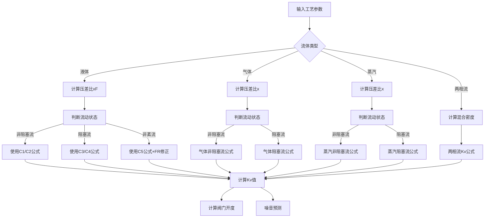

# Kv计算系统公式说明文档

## 概述

本文档详细说明了Kv_calculate.xlsx文件中的公式和计算关系。该系统用于**控制阀流量系数(Kv/Cv)计算**，涵盖液体、气体、蒸汽及两相流工况的Kv计算，以及噪音预测。

## 文件结构

| 工作表 | 用途 | 公式数量 |
|--------|------|----------|
| 液体 | 液体工况Kv计算 | 45个 |
| 可压缩 (4) | 气体/蒸汽/两相流Kv计算 | 140个 |
| Kv计算 | 主计算表（综合所有工况） | 157个 |
| 气体噪音计算 | 可压缩流体噪音预测 | 100个 |
| 液体噪音计算 | 液体噪音预测 | 50个 |
| 管道规格表 | 管道尺寸参考数据 | 0个（纯数据表） |

---

## 1. 基础输入参数

### 1.1 工艺参数

| 符号 | 名称 | 单位 | 说明 |
|------|------|------|------|
| T | 介质温度 | ℃ | 设计给定 |
| Q | 体积流量 | m³/h | 设计给定 |
| P1 | 阀前压力 | KPa | 设计给定 |
| P2 | 阀后压力 | KPa | 设计给定 |
| ρ | 流体密度 | Kg/m³ | 设计给定 |
| M | 分子量 | Kg/Kmol | 气体计算用 |
| Z | 压缩系数 | - | 气体计算用，默认1 |
| γ | 比热比系数 | - | 气体计算用，空气为1.4 |
| ν | 运动粘度 | m²/s | 层流计算用 |

### 1.2 阀门参数

| 符号 | 名称 | 说明 |
|------|------|------|
| DN | 公称通径 | mm |
| FL | 压力恢复系数 | 无附接管件时 |
| XT | 压差比系数 | 气体计算用 |
| Fd | 控制阀类型修正系数 | 按阀门类型确定 |
| R | 固有可调比 | 等百分比特性默认50 |
| Kv | 额定流量系数 | 设计给定 |

---

## 2. 核心计算公式

### 2.1 压力与温度转换

#### 阀前后压差
```
ΔP = P1 - P2
```
- 单元格: D21 (Kv计算表), E7 (液体表), E19 (可压缩表)

#### 入口绝对温度
```
T1 = T + 273.15  (当温度单位为℃时)
T1 = T           (当温度单位为K时)
```
- 公式: `=IF(D12="℃",D211+273.15,IF(D12="K",D211))`

#### 压力单位转换 (转为KPa绝对压力)
```
P1(KPa绝对) =
  - MPa(G): P1×1000 + 100
  - MPa(A): P1×1000
  - KPa(G): P1 + 100
  - KPa(A): P1
  - bar(G): P1×100 + 100
  - bar(A): P1×100
```
- 公式: `=IF(D18="MPa(G)",D17*1000+100,IF(D18="MPa(A)",D17*1000,...))`

### 2.2 相对密度计算

```
ρ/ρ0 = ρ1 / 1000
```
- 说明: 相对密度（比重）= 流体密度 / 水的标准密度(1000 Kg/m³)
- 适用: 液体及两相流工况

### 2.3 液体临界压力比系数 (FF)

```
FF = 0.96 - 0.28 × √(Pv / Pc)
```
- Pv: 入口温度下液体蒸汽压
- Pc: 绝对热力学临界压力
- 公式: `=0.96-0.28*SQRT(D209/(D34*1000))`

---

## 3. 液体Kv计算公式

### 3.1 流动状态判定

#### 非阻塞流/阻塞流判定（无附接管件）
```
非阻塞流: ΔP < FL² × (P1 - FF×Pv)
阻塞流:   ΔP ≥ FL² × (P1 - FF×Pv)
```
- 公式: `=IF(D202<D85^2*(D200-D88*D209),"非阻塞流","阻塞流")`

#### 非阻塞流/阻塞流判定（带附接管件）
```
非阻塞流: ΔP < (FLP/FP)² × (P1 - FF×Pv)
阻塞流:   ΔP ≥ (FLP/FP)² × (P1 - FF×Pv)
```
- 公式: `=IF(D202<(D87/D86)^2*(D200-D88*D209),"非阻塞流","阻塞流")`

#### 紊流/非紊流判定
```
Re < 10000: 非紊流（层流或过渡流）
Re ≥ 10000: 紊流
```
- 公式: `=IF(D145<10000,"非紊流","紊流")`

### 3.2 液体Kv计算

#### C1: 非阻塞流，无接管
```
C1 = Q / N1 × √(ρ/ρ0 / ΔP)
```
- 公式: `=E4/E83*SQRT(E9/E7)`

#### C2: 非阻塞流，带接管
```
C2 = Q / (N1 × FP) × √(ρ/ρ0 / ΔP)
```
- 公式: `=E4/E83/E28*SQRT(E9/E7)`

#### C3: 阻塞流，无接管
```
C3 = Q / (N1 × FL) × √(ρ/ρ0 / (P1 - FF×Pv))
```
- 公式: `=E4/E83/E27*SQRT(E9/(E5-E30*E13))`

#### C4: 阻塞流，带接管
```
C4 = Q / (N1 × FLP) × √(ρ/ρ0 / (P1 - FF×Pv))
```
- 公式: `=E4/E83/E29*SQRT(E9/(E5-E30*E13))`

#### C5: 非紊流
```
C5 = Q / (N1 × FR) × √(ρ/ρ0 / ΔP)
```
- 公式: `=E4/E83/E61*SQRT(E9/E7)`
- FR为雷诺数修正系数

### 3.3 管道几何形状系数 (FP)

```
FP = 1 / √(1 + ΣK/N2 × (Ci/d²)²)
```
- ΣK: 管件阻力系数之和
- 公式: `=1/SQRT(1+E56/E84*(E23/E36^2)^2)`

### 3.4 复合系数 (FLP)

```
FLP = FL / √(1 + FL²/N2 × ΣK × (Ci/d²)²)
```
- 公式: `=E27/SQRT(1+E27^2/E84*E56/(E23/E36^2)^2)`

### 3.5 管件阻力系数 (ΣK)

```
ΣK = K1 + K2 + KB1 - KB2
```
其中:
- K1 = 0.5 × (1 - (d/D1)²)²  (入口突然收缩)
- K2 = 1.0 × (1 - (d/D2)²)²  (出口突然扩大)
- KB1 = 1 - (d/D1)⁴         (伯努利系数1)
- KB2 = 1 - (d/D2)⁴         (伯努利系数2)

---

## 4. 气体/蒸汽Kv计算公式

### 4.1 压差比 (x)

```
x = ΔP / P1
```
- 公式: `=D202/D200`

### 4.2 比热比系数 (Fγ)

```
Fγ = γ / 1.4
```
- 公式: `=D159/1.4`

### 4.3 临界压差比 (xT)

```
xTP = xT / FP² / (1 + xT×(K1+KB1)/N5 × (C/d²)²)
```
- 带接管件时的修正

### 4.4 膨胀系数 (Y)

```
Y = 1 - x/(3×Fγ×xT)
```
- 适用于非阻塞流
- 公式: `=1-D154/3/D152/D155`

### 4.5 气体Kv计算

#### 非阻塞流，无接管
```
C = Qn / (N9×P1×Y) × √(22.4×M×Z×T1/x)
```
- 公式: `=D183/(D168*D200*D157)*SQRT(22.4*D193*D158*D37/D154)`

#### 阻塞流
```
C = Qn / (0.667×N9×P1) × √(22.4×M×Z×T1/(xT×Fγ))
```
- 公式: `=D183/(0.667*D168*D200)*SQRT(22.4*D193*D158*D37/(D155*D152))`

### 4.6 蒸汽Kv计算

#### 非阻塞流
```
C = W / (N6×Y×√(x×P1×ρ1))
```
- 公式: `=D187/(D165*D157*SQRT(D154*D200*D196))`

#### 阻塞流
```
C = W / (0.667×N6×√(Fγ×xT×P1×ρ1))
```
- 公式: `=D187/(0.667*D165*SQRT(D152*D155*D200*D196))`

---

## 5. 两相流Kv计算

### 5.1 液体+气体两相流

```
C = (Wl + Wg) / (3.16 × √(ΔP × ρm))
```
其中混合密度:
```
ρm = (Wl + Wg) / (Wl/(ρl/1000) + Wg/(ρg×Y²))
```
- 公式: `=(D182+D189)/(3.16*SQRT(D202*D111))`

### 5.2 液体+蒸汽两相流

```
C = (Wl + Ws) / (3.16×FL×√(P1×ρm×(1-FF)))
```
- 公式: `=(D182+D187)/(3.16*D85*SQRT(D200*D113*(1-D88)))`

---

## 6. 雷诺数与层流修正

### 6.1 阀门雷诺数 (Rev)

```
Rev = N4×Fd×Q / (ν×√(C×FL)) × (FL²×C²/(N2×D⁴) + 1)^0.25
```
- 公式: `=D163*D132*D181/D204/SQRT(D67*D85)*(D85^2*D67^2/(D162*D119^4)+1)^0.25`

### 6.2 雷诺数修正系数 (FR)

当 Rev ≥ 10000 (紊流):
```
FR = MIN(FR1, FR2)
```
其中:
```
FR1 = 1 + (0.33×FL^0.5 / λ^0.25) × LOG10(Rev/10000)
FR2 = 0.026/FL × √(λ×Rev)
λ = N2 / (C/d²)²
```

当 Rev < 10000 (层流/过渡流):
```
FR = FR2 = 0.026/FL × √(λ×Rev)
```

---

## 7. 阀门开度计算

### 7.1 等百分比特性

```
开度% = (1 - LOG10(m) / LOG10(R)) × 100
```
- m = Kv额定 / Kv计算
- R = 固有可调比（默认50）
- 公式: `=(1-LOG10(E88)/LOG10(E114))*100`

### 7.2 线性特性

```
开度% = (R - m) / ((R - 1) × m) × 100
```
- 公式: `=(E115-E88)/((E115-1)*E88)*100`

### 7.3 快开特性

```
开度% = (1 - √(R×(m-1) / ((R-1)×m))) × 100
```
- 公式: `=(1-SQRT(E115*(E88-1)/((E115-1)*E88)))*100`

---

## 8. 液体状态判定

### 8.1 压差比 (xF)

```
xF = (P1 - P2) / (P1 - Pv)
```
- 公式: `=(E8-E9)/(E8-E23)`

### 8.2 流体状态判定

| 条件 | 状态 |
|------|------|
| xF ≤ xFz | 无气蚀 |
| xFz < xF ≤ FL² | 初始气蚀 |
| FL² < xF ≤ 1 | 空化 |
| xF > 1 | 闪蒸 |

- 公式: `=IF(E28<=E37,"无气蚀",IF(AND(E37<E28,E28<=E29),"初始气蚀",IF(AND(E28>E29,E28<=1),"空化",IF(E28>1,"闪蒸"))))`

### 8.3 初生空化压差比 (xFz)

标准型阀门:
```
xFz = 0.9 / √(1 + 3×Fd×√(C/(N34×FL)))
```
- 公式: `=0.9/SQRT(1+3*E15*SQRT(E6/(E33*E14)))`

多级降压阀:
```
xFz = 1 / √(4.5 + 1650×No×dH²/FL)
```
- 公式: `=1/SQRT(4.5+1650*E13*E12^2/E14)`

---

## 9. 噪音计算

### 9.1 气体噪音计算（依据IEC 60534-8-3）

#### 缩流断面压力

亚音速流:
```
Pvc = P1 - (P1 - P2) / FL²
```

临界流:
```
Pvcc = P1 × (2/(γ+1))^(γ/(γ-1))
```

#### 流动状态判定

| 状态 | 条件 | 公式参考 |
|------|------|----------|
| 状态I | P2 ≥ P2C | 亚音速流 |
| 状态II | P2C > P2 ≥ Pvcc | 过渡流 |
| 状态III | Pvcc > P2 ≥ P2B | 临界流 |
| 状态IV | P2B > P2 ≥ P2CE | 常数声效系数 |
| 状态V | P2 < P2CE | 完全阻塞 |

#### 声功率级计算

```
Lpi = 10 × LOG10(3.2×10⁹ × Wa × ρ2 × c2 / Di²)
```
- Wa: 声功率(W)
- ρ2: 出口密度
- c2: 出口声速
- Di: 下游管道内径

#### 外部噪音（距阀门1m处）

```
Lpe = Lpi + ΔLp - 10×LOG10((Di+2tp+2)/(Di+2tp))
```
- ΔLp: 管道透射损失

### 9.2 液体噪音计算（依据IEC 60534-8-4）

#### 缩流断面流速

```
Uvc = (1/FL) × √(2×ΔPc/ρL)
```

#### 机械功率

```
Wm = m × Uvc² × FL² / 2
```

#### 声效系数

紊流:
```
ηturb = 10^Aη × (Uvc/cL)
```

空化流:
```
ηcav = 0.32×ηturb×√((P1-P2)/ΔPc)×EXP(5×xFzp)×((1-xFzp)/(1-xF))^0.5×(xF/xFzp)^5×(xF-xFzp)^1.5
```

#### 声功率

紊流:
```
Wa = ηturb × Wm
```

空化:
```
Wa = (ηturb + ηcav) × Wm × rw
```
- rw: 声功率比（按阀门类型选择，通常0.25）

---

## 10. 饱和蒸汽压与温度计算

### 10.1 安托因方程（水的饱和蒸汽压）

```
Pv = 10^(A - B/(C + T))
```
其中（水）:
- A = 8.07131
- B = 1730.63
- C = 233.426

- 公式: `=10^(D206-D207/(D208+D211))`

### 10.2 饱和温度反算

```
t = B/(A - LOG10(P1)) - C
```
- 公式: `=D207/(D206-LOG10(D200))-227.02`

---

## 11. 单位换算

### 11.1 流量换算

| 从 | 到 m³/h | 换算公式 |
|----|---------|----------|
| Kg/h | m³/h | Q = W / ρ |
| t/h | m³/h | Q = W×1000 / ρ |
| Nm³/h | m³/h | Q = Qn×P1×273.15 / (101.325×T1) |

### 11.2 粘度换算

| 从 | 到 m²/s | 换算公式 |
|----|---------|----------|
| mm²/s | m²/s | ν = μ×10⁻⁶ |
| cSt | m²/s | ν = μ×10⁻⁶ |
| cP | m²/s | ν = μ×ρ/1000 |
| mPa·s | m²/s | ν = μ×ρ/1000 |

### 11.3 Kv/Cv换算

```
Cv = Kv × 1.156
Kv = Cv / 1.156
```

---

## 12. 数值常数

| 符号 | 值 | 说明 |
|------|-----|------|
| N1 | 0.0865 | 液体Kv计算用 |
| N2 | 0.00214 | 管道几何系数用 |
| N4 | 76600 | 雷诺数计算用 |
| N5 | 0.00241 | 气体xTP计算用 |
| N6 | 31.6 | 蒸汽Kv计算用 |
| N9 | 22.4 | 气体Kv计算用 |
| N14 | 0.0049 | 噪音计算用 |
| N16 | 42300 | 噪音计算用 |
| N18 | 0.865 | Fd计算用 |

---

## 13. 错误检查

系统内置以下错误检查:

1. **压力检查**: 绝对压力不能小于0
2. **饱和压力检查**: 液体输入压力不能小于饱和蒸汽压
3. **温度检查**: 液体温度不能高于饱和温度
4. **压差检查**: 进口压力必须大于出口压力
5. **口径检查**: 阀门口径不能大于进口管道尺寸

---

## 14. 计算流程图



---

## 15. 参考标准

- IEC 60534-2-1: 工业过程控制阀 - 流通能力 - 计算公式
- IEC 60534-8-3: 工业过程控制阀 - 噪声预测 - 空气动力学噪声
- IEC 60534-8-4: 工业过程控制阀 - 噪声预测 - 液压流体噪声

---

## 附录: 管道规格表引用

系统通过VLOOKUP函数自动查询管道规格表获取:
- 管道外径
- 管道壁厚（按SCH等级）

查询公式示例:
```
外径 = VLOOKUP(DN, 管道规格表!B4:V39, 2, FALSE)
壁厚 = VLOOKUP(DN, 管道规格表!B4:V39, 14, FALSE)  # STD壁厚
```
